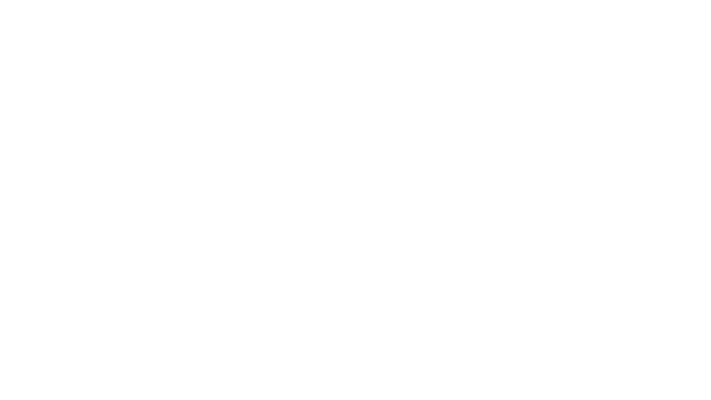

# Star-Wars-Quiz-App
By: Nicolas Angel
<p align="center"></p>

# Link to "Star Trivia!"
<a href="https://star-wars-trivia-game.herokuapp.com/">Click Here!</a>

# Project Description
"Star Trivia!" is my First attempt at a MERN stack app. This was designed as a fun, easy to use app and friendly to all ages.

"Star Trivia!" uses data stored in MONGODB to add in questions of your choosing and also have pre-selected questions. It has a page you can study on and sharpen your skills, powered by SWAPI, an open source Star Wars API. Users can browse the vast API for informations on Films, Characters, Species, and more! 


# Installation Instructions
* Clone this repo down to your local machine!
* Make an ENV File and add a mongoDB connection
* Run the following in the terminal...
```
npm i
```
```
npm i react-router-dom axios antd
```

# How to Browse "Star Trivia!"
DISCLAIMER: "Star Trivia!" is a work on progress, it will be updated and these pictures may be outdated!

This is the Home page, feel free to click any buttons to browse.
<p align="center"></p>

This is the Quiz page, where the main quiz will be taken.
<p align="center"></p>

This is the Create a question page.
<p align="center"></p>

And finally, this is the More information page, powered by SWAPI.
<p align="center"></p>

# Technology Used
* ANT Design
* Mongoose
* MongoDB
* Express.js
* React.js
* Node.js
* axios
* Vite

# Next Steps
I plan on implementing a few new steps...
* Unfortunately, while SWAPI was an awesome API to use, it does not include pictures NOR is it being worked on anymore. I want to integrate the Pipedream Photos API side by side with SWAPI that way all information points can have photos to go along with the data.
* I want to Paginate the More information area.
* Some more design features, One specifically is adding the gif at the top of the page to be the first thing you see when you launch the site!
* Add more questions.
* Adding the classic Star Wars crawl text! This is a must and I will be working towards getting it to work.

# Credits
**Nicolas Angel**

* Links:

  <p align="left">
  	<a target="_blank" rel="noopener noreferrer" href="https://github.com/nangel42"></a> 
  	<a target="_blank" rel="noopener noreferrer" href="https://www.linkedin.com/in/nicolasangel/"></a> 
  	<a target="_blank" rel="noopener noreferrer" href="https://nangel42.github.io/Nicolas-Angel-Portfolio/"></a> 
  </p>
